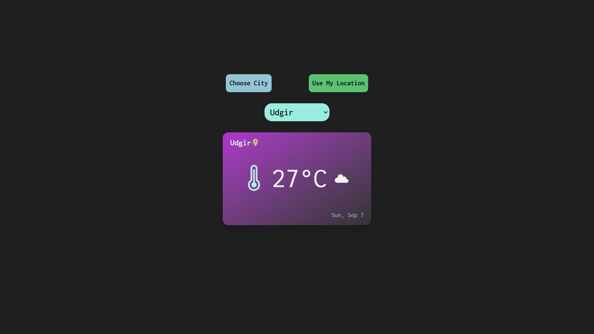

# 🌤️ Functional Weather App

A responsive and user-friendly weather application that provides real-time weather updates for any city worldwide. Built with React, Vite, and Tailwind CSS, this app fetches weather data from the OpenWeatherMap API and displays it in an intuitive interface.

---

## 🔍 Features

-Real-Time Weather Data: Get current weather conditions, temperature, humidity, wind speed, and weather description.
-City Search: Enter any city name to retrieve its weather information.
-Responsive Design: Optimized for both desktop and mobile devices.
-Error Handling: Displays user-friendly messages for invalid city names or API errors.

---

## ⚙️ Technologies Used

-Frontend: React js, Tailwind css
-API: Axios and OpenWeatherMap API (requires API key)
-Deployment: Vercel

---

## ## 🌤️ App Screenshot

---

## 🚀 Deployment

This app is deployed on Vercel. You can access the live version here:

## 🎥 Live link :  https://functional-weather-app.vercel.app/

---

## 🧪 Contributing

Feel free to fork this repository and submit pull requests. Contributions are welcome!

---

## 🧑‍💻 Ownership & License

All design, customization, and code of this project are my own. You may view and use this project for learning purposes only. All rights are reserved.
